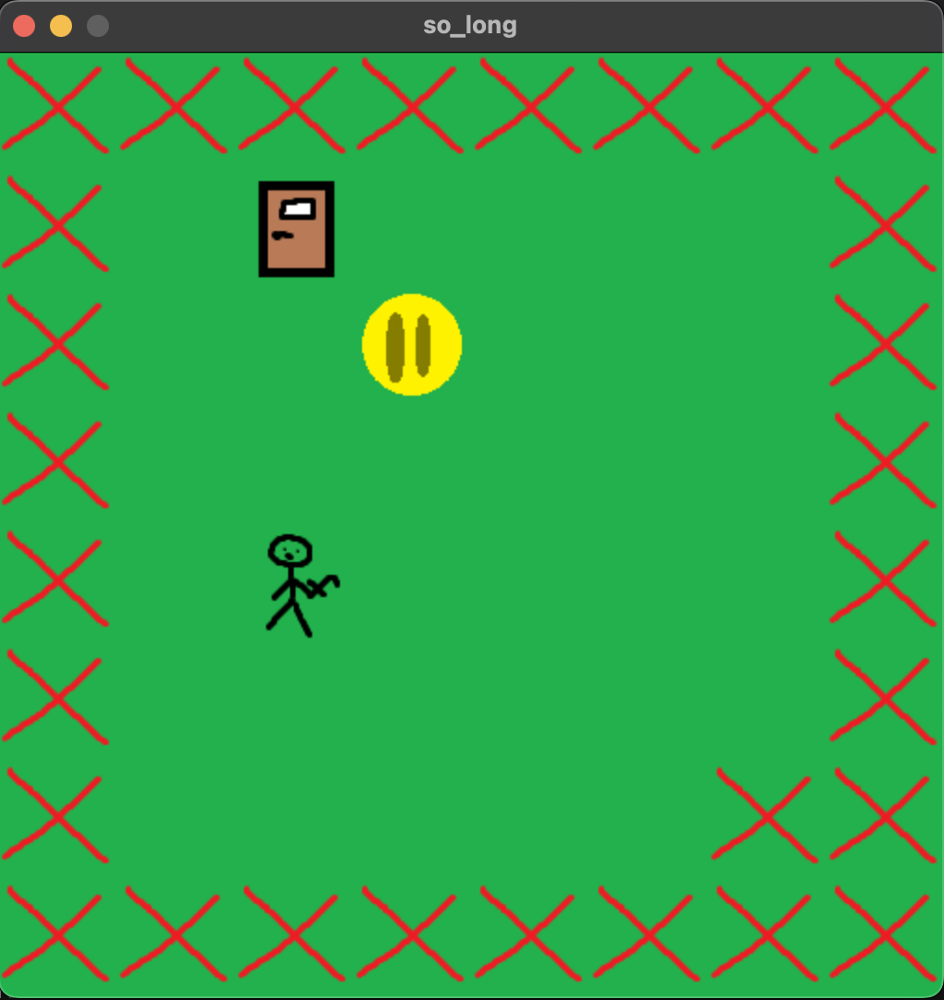

# so_long

`so_long` is a simple 2D game built using the [MiniLibX](https://harm-smits.github.io/42docs/libs/minilibx) library. The goal of the game is to collect all the collectibles and reach the exit while navigating through a map.

## Features
- 2D graphics using MiniLibX.
- Player movement with arrow keys.
- Map validation and error handling.
- Backtracking algorithm to ensure map playability.

## Requirements
- A Unix-like operating system.
- MiniLibX installed on your system.
- A compiler supporting C99 or later.

## How to Build and Run
1. Clone the repository:
   ```bash
   git clone git@github.com:Zaaii77/so_long.git
   cd so_long
   ```

2. Compile the project:
   ```bash
   make
   ```

3. Run the game with a valid map file:
   ```bash
   ./so_long path/to/map.ber
   ```

   Example:
   ```bash
   ./so_long maps/example.ber
   ```

## Map Format
- The map must be rectangular and surrounded by walls (`1`).
- It must contain at least:
  - One player starting position (`P`).
  - One exit (`E`).
  - One collectible (`C`).
- Other valid characters are `0` (empty space) and `1` (wall).

## Screenshot
Here is an example of the game in action:



## Controls
- **Arrow Keys**: Move the player.
- **ESC**: Exit the game.

## Notes
- The game uses the MiniLibX library for rendering.
- Ensure that your map file is valid and follows the required format.

## License
This project is licensed under the MIT License.
